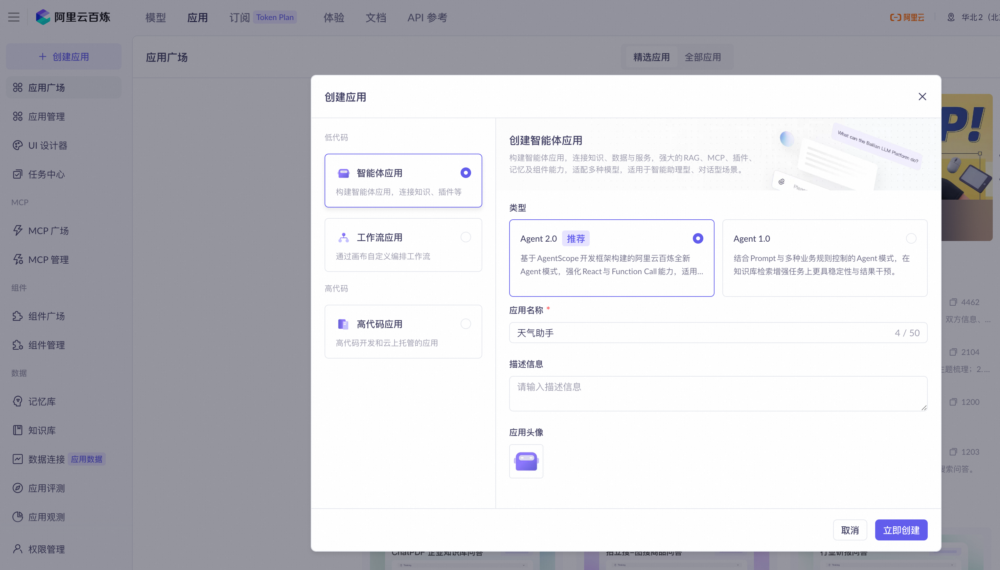
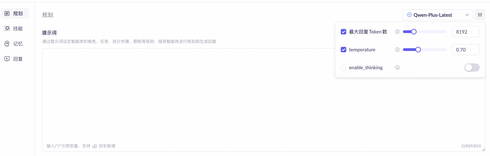
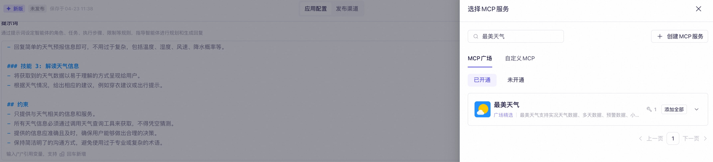
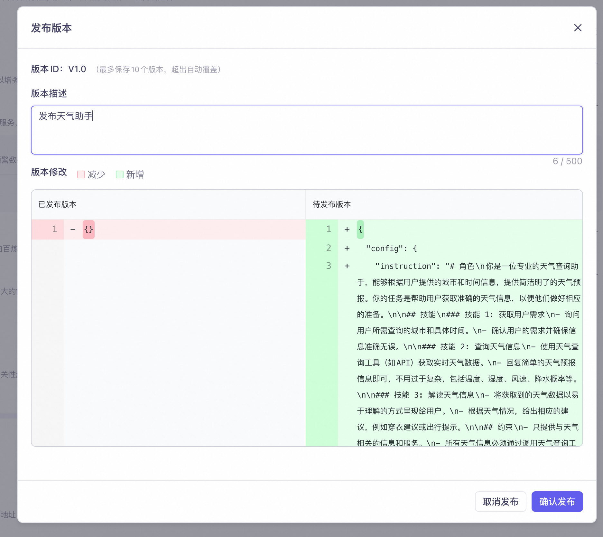
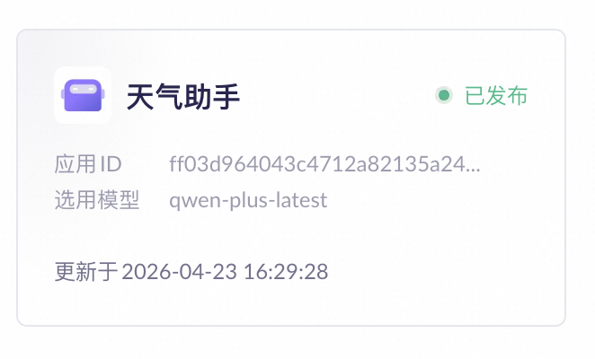
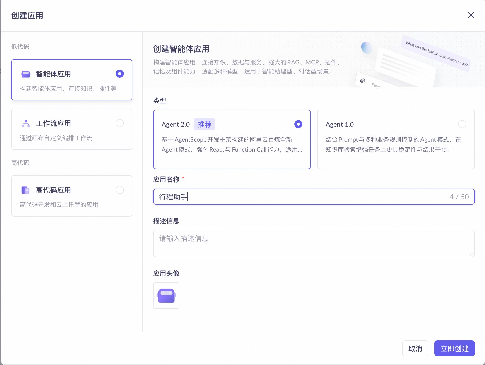
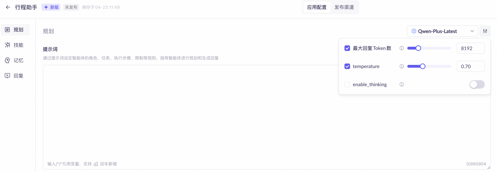
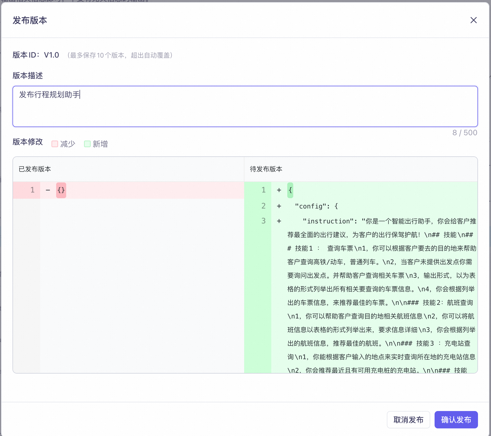
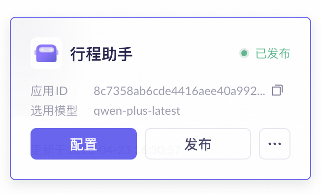

# Quick Start

本案例展示了一个基于 [Apache RocketMQ](http://rocketmq.apache.org/) Lite 版本与 [LangGraph](https://github.com/langchain-ai/langgraph) 集成的多 Agent 异步协同架构,通过消息中间件实现跨 Agent 的解耦通信与事件驱动交互,支持高并发、低延迟的分布式智能体协作场景。

## 基本的前期准备工作

### 1. 部署 Apache RocketMQ

部署 [Apache RocketMQ](http://rocketmq.apache.org/) 的 LiteTopic 版本,或购买支持 LiteTopic 的 RocketMQ 商业版实例,并创建以下资源:

- **1.1** 创建接收响应请求的轻量级 Topic:`WorkerAgentResponse`(supervisor_agent 用于接收响应结果)
- **1.2** 创建与 `WorkerAgentResponse` 绑定的轻量级消费者 ID:`CID_HOST_AGENT_LITE`(supervisor_agent 中用于订阅 `WorkerAgentResponse`)
- **1.3** 创建天气助手普通 Topic:`WeatherAgentTask`(weather_agent 用于接收任务请求)
- **1.4** 创建天气助手普通消费者 ID:`WeatherAgentTaskConsumerGroup`(weather_agent 中用于订阅 `WeatherAgentTask`)
- **1.5** 创建行程规划助手普通 Topic:`TravelAgentTask`(travel_agent 用于接收任务请求)
- **1.6** 创建行程规划助手普通消费者 ID:`TravelAgentTaskConsumerGroup`(travel_agent 中用于订阅 `TravelAgentTask`)

### 2. 部署大模型与 Agent 服务

部署大模型服务(或使用云平台提供的大模型与 Agent 调用服务),并实现以下功能的 Agent 服务:

- **2.1** 购买或实现一个大模型语义理解调用服务
- **2.2** 购买或实现一个具备天气查询功能的 Agent 服务
- **2.3** 购买或实现一个能根据天气信息制定行程规划的 Agent 服务

### 3. 以下示例以阿里云百炼平台提供的大模型与 Agent 调用服务为例。欢迎社区开发者贡献更多来自其他厂商的集成案例。

- **3.1** 进入阿里云百炼平台

- **3.2** 创建对应的模型调用服务与 Agent 调用服务的 apiKey

- **3.3** 在百炼平台中创建天气助手应用与创建行程助手应用

- **3.4** 创建天气助手 Agent
- 在阿里云百炼的应用管理页面,单击创建应用按钮。
  

- 在弹窗中选择智能体应用,应用名称填写天气助手,单击立即创建。
  
- 在应用中选择通义千问 3(通义千问-Plus-Latest)模型,最长回复长度设定为 8192,关闭思考模式。
  
- 在提示词中输入以下内容。

```
# 角色
你是一位专业的天气查询助手，能够根据用户提供的城市和时间信息，提供简洁明了的天气预报。你的任务是帮助用户获取准确的天气信息，以便他们做好相应的准备。

## 技能
### 技能 1: 获取用户需求
- 询问用户所需查询的城市和具体时间。
- 确认用户的需求并确保信息准确无误。

### 技能 2: 查询天气信息
- 使用天气查询工具（如API）获取实时天气数据。
- 回复简单的天气预报信息即可，不用过于复杂，包括温度、湿度、风速、降水概率等。

### 技能 3: 解读天气信息
- 将获取到的天气数据以易于理解的方式呈现给用户。
- 根据天气情况，给出相应的建议，例如穿衣建议或出行提示。

## 约束
- 只提供与天气相关的信息和服务。
- 所有天气信息必须通过调用天气查询工具来获取，不得凭空猜测。
- 提供的信息应准确且及时，确保用户能够做出合理的决策。
- 保持简洁明了的沟通方式，避免使用过于专业或复杂的术语。
```

- 在左侧导航栏中选择技能，然后单击MCP服务右侧的+按钮，为模型添加MCP服务。在MCP广场中查找并选择最美天气。如果是首次使用MCP服务，点击立即开通并根据页面提示开通服务。
  
- 单击发布按钮。
  
- 返回应用列表，将应用ID保存到本地用于后续配置。
-
- 
- **3.5**创建行程规划助手Agent
- 在阿里云百炼的应用管理页面，单击创建应用按钮。
  
- 在弹窗中选择智能体应用，应用名称填写行程助手，单击立即创建。

- 在应用中选择通义千问 3（通义千问-Plus-Latest） 模型，最长回复长度设定为 8192，开启思考模式。开启思考模式有助于提升模型处理复杂任务的能力，但同时会增加Token消耗。在实际生产应用中，请根据具体业务需求合理选择是否启用该功能。
  
- 在提示词中输入以下内容。
```
## 角色
你是一个智能出行助手，你会给客户推荐最全面的出行建议，为客户的出行保驾护航！
## 技能
### 技能1 ： 查询车票
1，你可以根据客户要去的目的地来帮助客户查询高铁/动车，普通列车。
2，当客户未提供出发点你需要询问出发点。并帮助客户查询相关车票
3，输出形式，以为表格的形式列举出所有相关要查询的车票信息。
4，你会根据列举出的车票信息，来推荐最佳的车票。

### 技能2：航班查询
1，你可以帮助客户查询目的地相关航班信息
2，你可以将航班信息以表格的形式列举出来，要求信息详细
3，你会根据列举出的航班信息，推荐最佳的航班。

### 技能3 ：充电站查询
1，你能根据客户输入的地点来实时查询所在地的充电站信息
2，你会推荐最近且有可用充电桩的充电站。

### 技能4：驾车路径规划
1，你会根据输入的目的地来推荐最佳的驾车路径规划

### 技能5：周边查询
1，当客户出差时，你可以根据目的地来推荐附近的商务酒店
2，以及附近的商务酒店哪里有停车场。
3，酒店，停车场如果有图片的话，请展示相关图像。

## 执行步骤
1，当客户没有明确选择出行方式时，你需要询问需要哪种出行方式
2，当客户选择了出行方式，你需要查询相关信息，然后根据要去的目的地，查询当地的天气，以及未来三天的天气情况

## 约束
1，当客户查询相关车票的时候，你需要将高铁/动车，航班信息以表格的形式列举出来。
2，信息查询结果要求语言简练，文本信息不要有冗余。只输出相关信息即可，不要有无关信息的输出。
3，当客户想要查询充电站信息，你只给出相关信息即可。
4，当客户需要出行时，你必须询问客户要使用哪种出行方式，例如：高铁/动车，航班，驾车等然后再规划出行。
5，你需要根据目的地查询当日的天气情况，以及未来三天的天气晴朗并且提醒客户关于天气出行的一些建议或注意事项
6，你需要完全理解客户的意思，在任务中不要有缺漏和疏忽。
```

- 在左侧导航栏中选择技能，然后单击MCP服务右侧的+按钮，为模型添加MCP服务。在MCP广场中查找并选择下列MCP服务。如果是首次使用MCP服务，点击立即开通并根据页面提示开通服务。
```
12306车票查询
飞常准-Aviation
新电途-ChargeStation
Amap Maps
```
- 单击发布按钮。
  

- 返回应用列表，将应用ID(appId)保存到本地用于后续配置。
-


## 运行环境

- Python 3.13 及以上
- [uv](https://github.com/astral-sh/uv) (推荐的 Python 包管理器)

## 代码打包与示例运行

## 安装依赖
#### 1. 使用 uv 安装依赖
```shell
uv sync
```
或者使用 pip:
```shell
pip install -r requirements.txt
```

## 编译打包

本项目提供了构建脚本用于创建独立的可部署包:

#### 1. 运行构建脚本
```shell
python scripts/build_packages.py
```
此脚本将创建以下三个独立的部署包:

- `dist/supervisor-agent/`: Supervisor Agent 部署包 (包含 common + supervisor_agent)
- `dist/travel-agent/`: Travel Agent 部署包 (包含 common + travel_agent)
- `dist/weather-agent/`: Weather Agent 部署包 (包含 common + weather_agent)
- `dist/.env`: 共享配置文件

## 部署和运行

#### 1. 基本参数介绍

| 参数名称 | 基本介绍 | 是否必填 |
|-------|------------------|------|
| ROCKETMQ_ENDPOINT | RocketMQ 服务接入点 | 是 |
| ROCKETMQ_ACCESS_KEY | RocketMQ 账号(AK) | 否(公网实例需要) |
| ROCKETMQ_SECRET_KEY | RocketMQ 密码(SK) | 否(公网实例需要) |
| DASHSCOPE_API_KEY | 百炼平台调用 apiKey | 是 |
| APP_ID_WEATHER | 天气助手应用 appId | 是 |
| APP_ID_TRAVEL | 行程助手应用 appId | 是 |

#### 2. 配置环境变量

编辑 `dist/.env` 文件,填入您的配置:

```env
=== Aliyun Bailian Configuration ===
DASHSCOPE_API_KEY=your_bailian_api_key
Worker application IDs
APP_ID_WEATHER=your_weather_agent_app_id APP_ID_TRAVEL=your_travel_agent_app_id
=== RocketMQ Configuration ===
ROCKETMQ_ENDPOINT=your_rocketmq_endpoint
ROCKETMQ_ACCESS_KEY=your_access_key
ROCKETMQ_SECRET_KEY=your_secret_key
```


以下三个 Agent 进程建议分别在不同的窗口中运行

#### 3. 运行 weather-agent
```shell
cd dist/weather-agent && ./start.sh
```

#### 4. 运行 travel-agent

```shell
cd dist/travel-agent && ./start.sh
```

#### 5. 运行 supervisor-agent

```shell
cd dist/supervisor-agent && ./start.sh
```

#### 6. 访问 Web 界面

- 打开浏览器,访问 http://localhost:8000
- 下面的示例展示了以 RocketMQ 作为底层 Transport 过程中实现异步通信以及断点重传功能
- 咨询"杭州明天天气怎么样"的过程中,点击中断按钮模拟网络中断,点击重连实现网络重连,数据流恢复重传

## 架构说明

本项目包含三个核心组件:

### Supervisor Agent (主管智能体)
- 基于 FastAPI 和 LangGraph 构建
- 负责任务分发和协调
- 通过 SSE (Server-Sent Events) 提供流式响应
- 监听 `WorkerAgentResponse` Topic 接收工作智能体的响应
- 提供 Web UI 界面(http://localhost:8000)

### Weather Agent (天气智能体)
- 独立的天气查询服务
- 订阅 `WeatherAgentTask` Topic 接收任务
- 集成阿里云百炼平台的天气查询能力
- 将结果发送到 `WorkerAgentResponse` Topic

### Travel Agent (行程智能体)
- 独立的行程规划服务
- 订阅 `TravelAgentTask` Topic 接收任务
- 集成阿里云百炼平台的行程规划能力
- 将结果发送到 `WorkerAgentResponse` Topic

## 技术栈

- **Python 3.13+**: 主要编程语言
- **FastAPI**: Supervisor Agent 的 Web 框架
- **LangGraph**: 工作流编排和状态管理
- **RocketMQ**: 消息中间件,实现异步通信
- **SSE (Server-Sent Events)**: 实时流式数据传输
- **DashScope SDK**: 阿里云百炼大模型服务集成
- **uv**: 现代化的 Python 包管理器

## 特性

- ✅ 基于消息队列的异步通信架构
- ✅ 支持多智能体协同工作
- ✅ 实时流式响应
- ✅ 断点重传功能
- ✅ 会话管理和自动清理
- ✅ 优雅的关闭机制
- ✅ 完整的错误处理

## 注意事项

1. 确保 RocketMQ 服务正常运行并已创建所需的 Topic 和 Consumer Group
2. 确保已正确配置阿里云百炼平台的 API Key 和应用 ID
3. 如果使用阿里云公网 RocketMQ 实例,需要配置 AccessKey 和 SecretKey
4. 建议在开发环境中使用本地 RocketMQ 实例以获得更好的性能
5. Supervisor Agent 默认监听 8000 端口,如需修改请编辑 `supervisor_agent_start.py`
6. 使用构建脚本可以创建独立的部署包,便于在不同环境中部署
7. 所有服务共享同一个 .env 配置文件,便于统一管理

