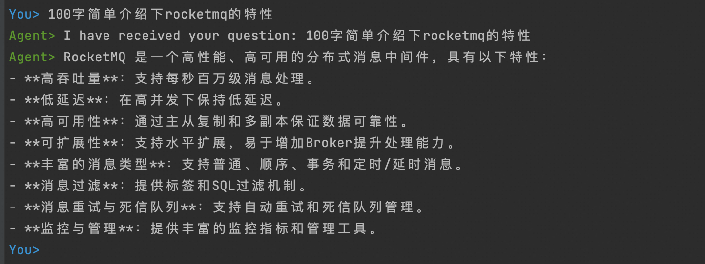

# Quick Start

本案例展示了一个基于 [Apache RocketMQ](http://rocketmq.apache.org/) Lite 版本与 [AgentScope](https://github.com/agentscope-ai) 集成的演示案例，通过消息中间件实现跨 Agent 的解耦通信与事件驱动交互，支持高并发、低延迟的分布式智能体协作场景。

## 基本的前期准备工作

### 1. 部署 Apache RocketMQ

部署 [Apache RocketMQ](http://rocketmq.apache.org/) 的 LiteTopic 版本(关于开源版本，预计在2月发布)，或购买支持 LiteTopic 的 RocketMQ 商业版实例，并创建以下资源：

- **1.1** 创建接收响应请求的轻量级Topic：`WorkerAgentResponse`(agentscope-client用于接收响应结果)
- **1.2** 创建与`WorkerAgentResponse` 绑定的轻量级消费者ID：`CID_HOST_AGENT_LITE`(agentscope-client中用于订阅`WorkerAgentResponse`)
- **1.3** 创建普通Topic：`LLM_TOPIC`(agentscope-server用于接收请求)
- **1.4** 创建普通消费者CID：`LLM_CID`(agentscope-server中用于订阅`LLM_TOPIC`)

### 2. 获取大模型服务

1. 进入阿里云百炼平台
2. 获取对应调用服务的apiKey

## 运行环境

- JDK 17 及以上
- [Maven](http://maven.apache.org/) 3.9 及以上

## 代码打包与示例运行

#### 1. 编译打包

```shell
mvn clean package -Dmaven.test.skip=true -Dcheckstyle.skip=true
```
#### 2. 基本参数介绍

| 参数名称  | 基本介绍             | 是否必填 |
|-------|------------------|------|
| rocketMQEndpoint | rocketmq服务接入点    | 是    |
| rocketMQNamespace | rocketmq命名空间     | 否    |
| bizTopic | 普通Topic          | 是    |
| bizConsumerGroup | 普通消费者CID         | 是    |
| rocketMQAK | rocketmq账号       | 否    |
| rocketMQSK | rocketmq密码       | 否    |
| apiKey | 百炼平台调用apiKey     | 是    |
| appId | 对应百炼智能应用appId    | 是    |
| workAgentResponseTopic | LiteTopic        | 是    |
| workAgentResponseGroupID | LiteConsumer CID | 是    |

以下2个Agent进程建议分别在不同的窗口中运行

#### 3.运行agentscope-server
```shell
cd agentscope-server
```
```shell
mvn exec:java -Dexec.mainClass=io.agentscope.AgentScopeDeployRocketMQExample -DrocketMQEndpoint= -DrocketMQNamespace= -DbizTopic=LLM_TOPIC -DbizConsumerGroup=LLM_CID -DrocketMQAK= -DrocketMQSK= -DapiKey=
```
#### 4.运行agentscope-client

```shell
cd agentscope-client
```
```shell
mvn compile exec:java -Dexec.mainClass=io.agentscope.A2aAgentCallerExample -DrocketMQNamespace= -DworkAgentResponseTopic=WorkerAgentResponse -DworkAgentResponseGroupID=CID_HOST_AGENT_LITE -DrocketMQAK= -DrocketMQSK= 
```

启动后可在终端与agentscope构建的agent进行会话


