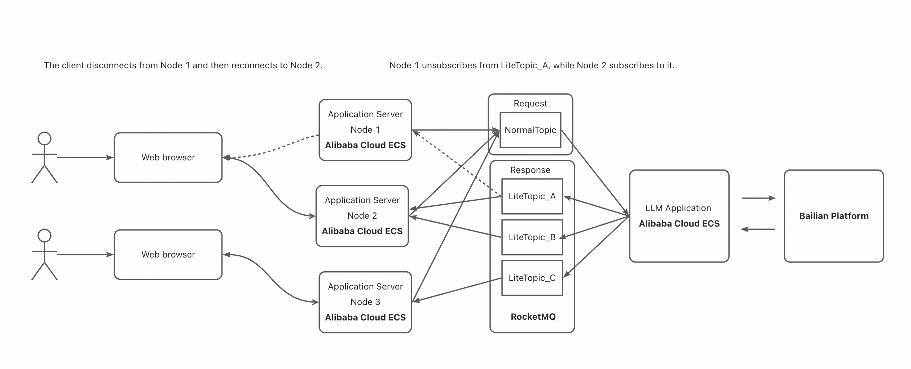

# Quick Start

This solution leverages **LiteTopic** capability of [Apache RocketMQ](http://rocketmq.apache.org/) to provide an efficient and reliable approach for managing long-lived connections in distributed web applications. It addresses key challenges such as precise message delivery and session state consistency across multiple nodes.

## Architecture Overview




## Prerequisites

### 1. Deploy Apache RocketMQ with LiteTopic Support

Use a RocketMQ version that supports LiteTopic (open-source release expected in February), or use Alibaba Cloud's commercial edition. Create the following resources:

- **1.1** Create a LiteTopic for receiving response messages: WorkerAgentResponse (used by SupervisorAgent to receive response results).
- **1.2** Create a Lite consumer ID associated with WorkerAgentResponse: CID_HOST_AGENT_LITE (used by SupervisorAgent to subscribe to the response topic).
- **1.3** Create a normal Topic: LLM_TOPIC (used by LLMAgent to receive incoming requests).
- **1.4** Create a normal consumer ID: LLM_CID (used by LLMAgent to subscribe to the request topic).

### 2. Configure LLM API Credentials (Example: Alibaba Cloud Bailian Platform), Community contributions for other providers (e.g., Moonshot, Minimax, DeepSeek) are welcome.

1. Log in to [Alibaba Cloud Bailian Console](https://bailian.console.aliyun.com/)

2. Create a model service and obtain your `API Key`

## Runtime Requirements

- JDK 17 or later
- Maven 3.9 or later

## Build & Run Instructions

### 1. Compile and Package

```shell
mvn clean package -Dmaven.test.skip=true -Dcheckstyle.skip=true
```

### 2. Configuration Parameters
| Parameter  | Description                                   | Required |
|-------|-----------------------------------------------|----------|
| rocketMQEndpoint | RocketMQ endpoint address                     | Yes      |
| rocketMQNamespace | RocketMQ Namespace                            | No       |
| bizTopic | Normal topic name for request handling                  | Yes      |
| bizConsumerGroup | Consumer group ID for normal topic                  | Yes      |
| rocketMQAK | AccessKey for authentication                                    | No       |
| rocketMQSK | SecretKey for authentication                     | No       |
| apiKey | API Key from Bailian platform                                  | Yes      |
| workAgentResponseTopic | LiteTopic name for response reception       | Yes      |
| workAgentResponseGroupID | LiteConsumerCID，SupervisortAgent用于订阅LiteTopic | Yes      |
| agentTopic | Lite consumer group ID                    | Yes      |


### 3.Start LLMAgent (Model Processing Node)
```shell
cd LLMAgent/target
```
```shell
java -DrocketMQEndpoint= -DrocketMQNamespace= -DrocketMQAK= -DrocketMQSK= -DbizTopic=LLM_TOPIC -DbizConsumerGroup=LLM_CID -DapiKey= -jar LLMAgent-2.1.1-SNAPSHOT.jar
```

### 4.Run SupervisorAgent-Web (Process 1, listening on port 9090)
```shell
cd SupervisorAgent-Web/target
```
```shell
java  -DrocketMQEndpoint= -DrocketMQNamespace= -DworkAgentResponseTopic=WorkerAgentResponse -DworkAgentResponseGroupID=CID_HOST_AGENT_LITE -DrocketMQAK= -DrocketMQSK= -DagentTopic=LLM_TOPIC -jar SupervisorAgent-Web-2.1.1-SNAPSHOT.jar --server.port=9090
```

### 5.Run SupervisorAgent-Web (Process 2, listening on port 9090)
```shell
cd SupervisorAgent-Web/target
```
```shell
java  -DrocketMQEndpoint= -DrocketMQNamespace= -DworkAgentResponseTopic=WorkerAgentResponse -DworkAgentResponseGroupID=CID_HOST_AGENT_LITE -DrocketMQAK= -DrocketMQSK= -DagentTopic=LLM_TOPIC -jar SupervisorAgent-Web-2.1.1-SNAPSHOT.jar --server.port=9191
```

### 6.Run SupervisorAgent-Web (Process 3, listening on port 9090)
```shell
cd SupervisorAgent-Web/target
```
```shell
java  -DrocketMQEndpoint= -DrocketMQNamespace= -DworkAgentResponseTopic=WorkerAgentResponse -DworkAgentResponseGroupID=CID_HOST_AGENT_LITE -DrocketMQAK= -DrocketMQSK= -DagentTopic=LLM_TOPIC -jar SupervisorAgent-Web-2.1.1-SNAPSHOT.jar --server.port=9292
```

### 7.开始访问，在浏览器中输入http://localhost:9090

