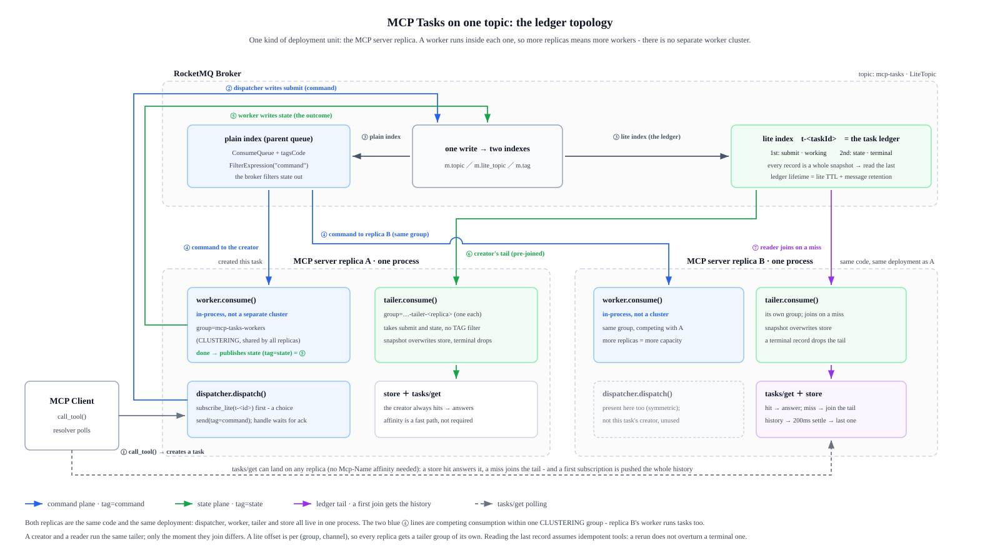

# mcp-tasks-rocketmq

The `io.modelcontextprotocol/tasks` extension (SEP-2663), executed by a RocketMQ
worker pool with one LiteTopic channel per task as its ledger.

A plugin for the `mcp` package: it composes SDK extension points and carries the
tasks runtime the SDK does not ship. Use `Tasks` + `RocketMQTaskBackend` in your
own server.

```bash
pip install mcp-tasks-rocketmq
```

## Requirements

| requirement | why |
|---|---|
| `mcp >= 2.2.0` | the extension points this plugin composes (`mcp.server.extension`, `mcp.server.context`, `mcp.server.mcpserver`) arrived in the 2.x line |
| `rocketmq-python-client >= 5.1.1` | supplies `LitePushConsumer` |
| Apache RocketMQ **>= 5.5.0** | LiteTopic ([RIP-83](https://rocketmq.apache.org/docs/domainModel/03litetopic/)) is the ledger: one lite channel per task |

All of it is public - the two Python packages resolve from PyPI, and LiteTopic is
in the open-source broker since 5.5.0. To see the mechanism before provisioning
anything, [`examples/offline_walkthrough.py`](examples/offline_walkthrough.py)
runs the whole lifecycle against an in-memory stand-in for the client:

```bash
python examples/offline_walkthrough.py
```

## Components

| module | role |
|---|---|
| `mcp_tasks_rocketmq.tasks` | the server half: `Tasks` extension, `TaskDispatcher`/`TaskLedger` protocols, the local dispatcher |
| `mcp_tasks_rocketmq.client` | the client half: `TasksClient`, which claims the `task` shape and polls it to a result |
| `mcp_tasks_rocketmq.rocketmq` | the RocketMQ backend: `RocketMQTaskDispatcher`, `RocketMQTaskWorker`, `RocketMQTaskTailer`, `RocketMQTaskBackend` |
| `mcp_tasks_rocketmq.server` | deployment wiring: `build_server()` plus a stdio/HTTP entry point |
| `mcp_tasks_rocketmq.worker` | standalone worker processes to scale execution out |
| `mcp_tasks_rocketmq.wire` | SEP-2663 wire shapes (`CreateTaskResult`, `tasks/get` pair) |

## Run it

The tools are yours: both entry points take `--tools module:attr`, where `attr`
is a callable returning `(register, task_tools)` - a function that registers
your tools on an `MCPServer`, and the names that should run as tasks. The same
spec serves the server and every standalone worker, so the registries cannot
drift (see [`examples/demo_tools.py`](examples/demo_tools.py); the module has to
be importable, hence `PYTHONPATH` below).

Two deployment shapes, one mechanism:

- **Merged (default)** - the server process also runs a worker of the pool:
  one build, one lifespan, one tool registry.

  ```bash
  RMQ_ENDPOINTS=broker:8080 PYTHONPATH=examples \
    uv run python -m mcp_tasks_rocketmq --tools demo_tools:demo_tools --http
  ```

- **Split** - the server only creates tasks (`--no-worker`); the pool lives in
  standalone worker processes under the same consumer group, which is also how
  execution scales past the merged base capacity.

  ```bash
  # server (creating replica only)
  RMQ_ENDPOINTS=broker:8080 PYTHONPATH=examples \
    uv run python -m mcp_tasks_rocketmq --tools demo_tools:demo_tools --http --no-worker
  # one or more workers
  RMQ_ENDPOINTS=broker:8080 PYTHONPATH=examples \
    uv run python -m mcp_tasks_rocketmq.worker --tools demo_tools:demo_tools
  ```

The entry points read `RocketMQConfig.from_env()` (`RMQ_ENDPOINTS` required;
`RMQ_AK`, `RMQ_SK`, `RMQ_NAMESPACE`, `RMQ_TASKS_TOPIC`, `RMQ_WORKER_GROUP`,
`RMQ_TAILER_GROUP_PREFIX`, `RMQ_REPLICA_ID` optional).

To integrate the plugin into your own server, pass your register function and
task-tool names to `build_server` - no environment needed (see
[examples/](examples/)):

```python
from mcp_tasks_rocketmq import RocketMQConfig, build_server
from mcp_tasks_rocketmq.worker import build_standalone_worker

def register_tools(mcp):
    @mcp.tool()
    async def generate_report(query: str) -> str:
        """Long-running, so it runs as a task."""
        ...

config = RocketMQConfig(endpoints="broker:8080")
server = build_server(
    config, task_tools=frozenset({"generate_report"}), register_tools=register_tools
)
# split deployment: the worker process registers the same tools
worker = build_standalone_worker(config, register_tools=register_tools)
```

Client-side, the extension is not optional: a server built this way refuses a
client that does not declare `io.modelcontextprotocol/tasks`, and a client that
declares it without claiming the `task` result shape cannot parse the handle it
gets back. `TasksClient` is both halves of that declaration, and its resolver
polls the task to completion:

```python
from mcp import Client
from mcp_tasks_rocketmq import TasksClient

async with Client(server, extensions=[TasksClient()]) as client:
    # Returns the tool's own result. Whether the server ran it inline or as a
    # task is invisible here - the handle and the polling are the resolver's.
    result = await client.call_tool("generate_report", {"query": "..."})
```

`TasksClient(timeout_s=..., retries=..., fallback_poll_interval_ms=...)` tunes the
resolver: how long a task may take, how many unreadable answers to absorb, and
how often to ask when the server suggests no interval. To observe the task's
states instead of having them resolved away, opt out per call with
`session.call_tool(..., allow_claimed=True)` and poll `tasks/get` by hand -
[`merged_deployment.py`](examples/merged_deployment.py) does exactly that.

## RocketMQ resources

On a broker at 5.5.0 or later, the plugin needs one topic and two consumer
groups:

| resource | default | kind |
|---|---|---|
| `RMQ_TASKS_TOPIC` | `mcp-tasks` | topic with the **LiteTopic** attribute - parent of the `t-<taskId>` channels |
| `RMQ_WORKER_GROUP` | `mcp-tasks-workers` | plain group, shared by the whole pool: submitted work is a queue |
| `RMQ_TAILER_GROUP_PREFIX` + replica id | `mcp-tasks-tailer-<id>` | **LITE_SELECTIVE** group, one per replica: a lite offset is per (group, channel) |

The tailer group has to be `LITE_SELECTIVE` with a non-zero lite subscription
quota. A `LitePushConsumer` whose group is neither blocks on startup instead of
failing, which looks like a hung server rather than a misconfigured group.

## Architecture



One parent topic and one channel per task (`t-<taskId>`) carry the whole
lifecycle. Every message is written once and read by two faces, because two faces
is what a lite message already is: the broker writes it to the parent topic's own
ConsumeQueue *and then* dispatches it to the lite queues
(`ConsumeQueue.putMessagePositionInfoWrapper` -> `multiDispatchLmqQueue`).

- **The parent face** - the worker pool, a plain consumer group subscribing the
  parent topic with `FilterExpression("command")`. A submitted task must run
  exactly once, which is what competing consumption already means, and a plain
  subscription brings its whole operational surface along: retries, the
  dead-letter topic, backlog alarms. The TAG is what keeps the pool from picking
  up its own write-backs and feeding itself.
- **The channel face** - `t-<taskId>`, tailed by every replica with a reason to
  follow it: the one that created the task subscribes before it submits, and any
  other subscribes when a `tasks/get` misses its store. Each replica tails under a
  group of its own, because a lite subscription's offset is per (group, channel):
  two replicas sharing one group would take each other's records and reset each
  other's position.

### The channel is the ledger

The submit message is not only the pool's instruction, it is the task's first
record - `status: "working"` plus the handle's own `createdAt` - and the write-back
is its second, carrying the executed status, the result, and that `createdAt`
echoed back. Each record is a whole snapshot by itself, so a task's state is on
the broker from the moment its handle exists and reading it is never a matter of
putting records back together.

So a `tasks/get` that lands on a replica which never created the task can still
answer it, and `Mcp-Name` affinity goes back to being what it was meant to be: a
fast path, not the only thing holding the read path up. A replica that dies takes
its store with it, no longer the task.

### TAG and status are two axes

On purpose. The TAG says who *receives* a message (`command` -> the pool, `state`
-> not the pool); `body.status` says what the *protocol* state is, and the tailer
reads nothing else - it takes both kinds of message and writes both, which is why
the submit record needs no special case. Extending the state machine is then a
change to bodies, and the routing stays where it is.

| message | tag | body |
|---|---|---|
| submit | `command` | `{"taskId", "name", "arguments", "status": "working", "createdAt"}` |
| write-back | `state` | `{"taskId", "status", "result", "createdAt", "lastUpdatedAt"}` |

### Reading the ledger is following it

A store miss subscribes the channel and waits, and the callback that receives each
record writes it straight into the store. The 5.x Python client's
`subscribe_lite` takes no offset option and needs none: a (group, channel) pair
that has never consumed is pushed the channel's whole history from its earliest
record, so a replica joining late still reads the task from the beginning - while
a replica whose offset has already advanced gets no replay, which is what makes a
channel let go at its terminal record let go for good.

Because that history arrives one record at a time, a read waits for the channel to
go quiet (`SETTLE_S`) instead of answering at the first record, so what it answers
with is the newest one. `PeekMessage` (Lite Peek) is the better read - stateless,
no wait, and an empty channel is an authoritative "no such task" - and is not in
the client yet; when it arrives, only the data source changes.

### Ordering, duplicates, and the one premise

Order within a channel is total: one lite channel maps to one queue on one broker,
so what was written first is read first, and the newest record is the task's state.

Delivery is still at-least-once, so an execution that runs twice appends the same
record twice. That costs nothing under the one premise this design makes: **the
tool is idempotent**, so a re-run produces the same status and the same result, and
a duplicate record cannot overturn a terminal state. The premise sits on the
execution side rather than the protocol - a tool with external side effects is what
breaks it.

### Deployment and shutdown order

`RocketMQTaskBackend` runs both roles in one process and is the default, because
the tool registry, the submit leg and the write-back leg are all the same build.
Merging adds one constraint, on shutdown: the worker must stop consuming and drain
what it is running *before* the tailer closes, or a write-back lands in a channel
nobody is following and its task stays `working` in this replica's store until
something reads the ledger again. Extra `mcp_tasks_rocketmq.worker` processes under
the same consumer group scale execution out without changing either role.

### Threading

`consume` arrives on the client's own thread. The tailer hands the record to the
server's event loop and blocks its thread until the store write is done, so a
delivery is over when the callback returns; the worker drives the tool coroutine on
its serving loop the same way - which is what makes the pool's concurrency its
thread count. Merged, that serving loop is the server's own, so a task tool shares
it with request handling: the point of the pool becomes *not occupying the request*
rather than not occupying the process.

## Limitations

| limitation | detail |
|---|---|
| `tasks/get` only | `tasks/update` and `tasks/cancel` belong to the full state machine and are not bound |
| No push notifications | polling `tasks/get` is the only read path: the SDK's `ServerEvent` is a closed union of resource, tool and prompt events, so `notifications/tasks` has no event to carry it |
| Task state is per-process memory | a restart loses this replica's store; state is recoverable only for tasks whose ledger channel still holds records |
| Bounded tails | a replica follows at most 64 channels at once (`MAX_ACTIVE_TAILS`) |
| Bounded ledger read | a store-missing `tasks/get` waits 5s (`READ_DEADLINE_S`) and then answers `INTERNAL_ERROR`, which says the state is unknown - not that the task is absent |

## Development

```bash
uv sync
uv run pytest           # no broker needed - the suite fakes one
```

The test suite substitutes a fake broker that reproduces lite delivery, so the
whole mechanism is exercised offline, and
[`examples/offline_walkthrough.py`](examples/offline_walkthrough.py) does the same
for a readable end-to-end run. `merged_deployment.py` is the only part that needs
a real instance.

### Following the schema

`tasks.py` and `wire.py` carry the `io.modelcontextprotocol/tasks` server half and
its wire shapes. SEP-2663 moved tasks out of the MCP core, so the authority for
the shapes is the extension's own schema repository
([ext-tasks](https://github.com/modelcontextprotocol/ext-tasks)) rather than
`mcp_types`, whose task types describe the 2025-11-25 in-core design that
SEP-2663 replaced. The SDK ships the extension points and no tasks runtime; its
`examples/stories/tasks/` is a second implementation of the same protocol, worth
comparing against.

When either moves, the check is `uv run pytest`: the suite covers the extension's
own seams (`intercept_tool_call`, `tasks/get`, the ledger fallback), so a changed
envelope or extension API shows up there rather than in production.

## License

Apache License 2.0. See the [LICENSE](https://github.com/apache/rocketmq-a2a/blob/main/LICENSE) at the repository root.
